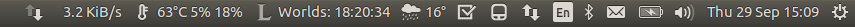

Countdown Indicator
===================

Excitement for an event can now be increased by a little indicator. It counts down the time to your next favorite event. It is fully customizable and helps you hype up.

(With Changed Icon to League of Legends Event)

Features
--------

- Setup via Dialogs
- Custom Icons
- Custom Text that can be formatted
- Never lose track of special events

Installation
------------

Run the following command for installation:

`sudo sh install.sh`

To add to autostart (can be done via the UI):

`sh enable-autostart.sh` 

To remove from autostart (can be done via the UI):

`sh disable-autostart.sh` 

To Uninstall:

`sudo sh uninstall.sh`

Usage
-----

Just enter all the data. Keep in mind, that currently you have to enter a UTC timestamp. So you have to to the timezone shifting in your head. Sorry about that.

To Do
-----

- Improve dialogs
- Add more customizable format string, e. g. custom hours, minutes etc.
- Timezone aware settings
